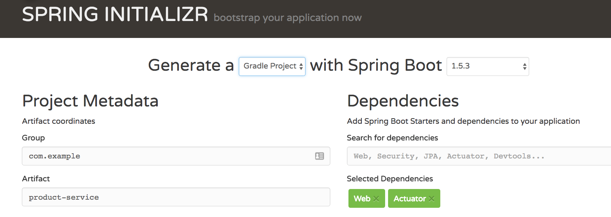
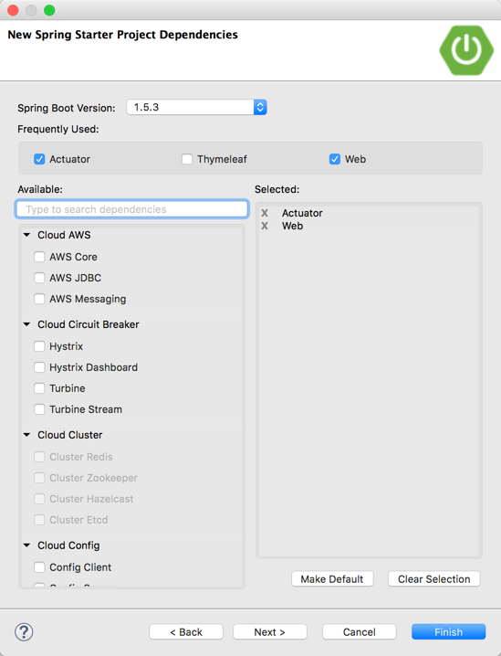
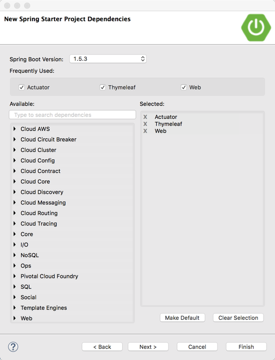

# Lab 1

The following are some of hands on exercises to reinforce key concepts in the Marketplace Service

## Concepts To Learn
1. Get Experience with Spring Boot 
2. Create a simple UI using Spring Boot and ThymeLeaf
3. Create a simple Product Backing Service using Spring Boot
4. Communicate Via Rest Between Two Services
5. Wrapping a service call with circuit breaker
6. Deploying To PCF
7. Working with Basic Security
8. Learn about Spring Profiles

## Building Out The Rest Services

### Create The Project

Lets create a basic Rest Client (product-service), this can be done from the command line if you have curl.

```shell

curl https://start.spring.io/starter.tgz -d style=web,actuator -d groupId=com.sample -d name=product-service -d type=gradle-project | tar -xzvf -

```
It can also be done using start.spring.io, you can select the projects on the form (this is what the curl command posts too).



Lastly you can create it with a wizard in STS or IntelliJ.


Ensure to pick the dependancies 'Web' and 'Actuator'




Once created, import the project into your workspace (using Import Gradle/Maven). If you made this project using an IDE plugin, it will already be created.


### Create The Model Object

Create a class called Product. Add the following attributes:

```java

public class Product {

	private Long id;
	private String name;
  
  public Product() { }

	public Product(Long id, String name) {
		this.id = id;
		this.name = name;
	}

	public String getName() {
		return name;
	}

	public void setName(String name) {
		this.name = name;
	}

	public Long getId() {
		return id;
	}

	public void setId(Long id) {
		this.id = id;
	}

}

```

Optionally this can be converted to Lombok to dramatically reduce the lines of code in the object definition. Why would this matter?

https://projectlombok.org/download.html

### Create the Rest Endpoint

Create a class called 'ProductController'.

Add the following:

```java

@RestController
@RequestMapping("/v1")
public class ProductController {
	
	@GetMapping("/product")
	public ResponseEntity<Iterable<Product>> products() {
  
		List<Product> products = new ArrayList<Product>();
		products.add(new Product(Long.valueOf(1), "Car"));
		products.add(new Product(Long.valueOf(2), "Boat"));
		products.add(new Product(Long.valueOf(3), "Real Live Dinosaur"));
		return ResponseEntity.ok(products);
	}

}


```

Start your application (using java -jar target/product-service-0.0.1-SNAPSHOT.jar or in your IDE) and test the end point at: http://localhost:8080/v1/product

### Enable Actuator

Add the following to your application.properties.

```shell

endpoints.sensitive=false

```

Restart your application and try some of the end points:

- http://localhost:8080/mappings
- http://localhost:8080/health
- http://localhost:8080/env

### Add Swagger For Testing

Swagger is a great way to test rest end points. In this case we only have one end point, it will not always be that way :-)

#### Add the following to your dependancies

Add to your build.gradle the following:

```shell

compile("io.springfox:springfox-swagger2:2.6.1")
compile("io.springfox:springfox-swagger-ui:2.6.1")

```

#### Add the configuration for Swagger

Create a class called SwaggerConfig and add the following:

```java


import org.springframework.context.annotation.Bean;
import org.springframework.context.annotation.Configuration;

import springfox.documentation.builders.PathSelectors;
import springfox.documentation.builders.RequestHandlerSelectors;
import springfox.documentation.spi.DocumentationType;
import springfox.documentation.spring.web.plugins.Docket;
import springfox.documentation.swagger2.annotations.EnableSwagger2;

@Configuration
@EnableSwagger2
public class SwaggerConfig {
	
	@Bean
    public Docket api() {
        return new Docket(DocumentationType.SWAGGER_2)
                .select()
                .apis(RequestHandlerSelectors.basePackage("com.example"))
                .paths(PathSelectors.any())
                .build();
    }

}


```
The Swagger Endpoints can now be tested at this URL:

http://localhost:8080/swagger-ui.html


### Deploy to Cloud Foundry

Create a file in the root of the project called 'manifest.yml'. Add the following to this file:

```shell

---
applications:
- name: product-service
  memory: 1024M
  buildpack: java_buildpack
  path: build/libs/product-service-0.0.1-SNAPSHOT.jar
  routes:
  - route: product-service.cfapps.io


```

Ensure to clean and build your Gradle project `./gradlew clean build` and then deploy to PWS by running `cf push` from the same folder as the manifest.yml. Also you can deploy to PCF using the STS plugin. If the host is already taken, update the `route` name to be more unique in the manifest.yml file.


## Building Out The UI Client

### Creating the Project

Lets build out a basic UI.  We will call this ui-service.

```shell

curl https://start.spring.io/starter.tgz -d style=web,thymeleaf,actuator -d groupId=com.example -d name=ui-service -d type=gradle-project | tar -xzvf -

```

If you are using start.spring.io, simply select the following projects: web, actuator, thymeleaf



Once created, import into your IDE of choice (ie: import existing Gradle project).

### Adding A Thymeleaf Template

This project uses Thymeleaf, a very simple HTML attribute based templating engine. Lets add our basic UI. Inside of src/main/resources/templates, create a file called index.html and paste the following into it.

```html
<!DOCTYPE HTML>
<html xmlns:th="http://www.thymeleaf.org">
<head>
    <title>Simple UI</title>
    <meta http-equiv="Content-Type" content="text/html; charset=UTF-8" />
</head>
<body>
	
	<p th:text="'Hello, ' + ${name} + '!'" />
    
</body>
</html>

```
Note: The reference 'marketplace' application demonstrates some of the more useful features of Thymeleaf.

### Adding A Simple Controller

Create a simple class to display the index page and put some data into it:

```java

@Controller
public class HomeController {
	

	@GetMapping("/")
	public String home(Model model) {
		model.addAttribute("name", "Scott Lang");
		return "index";
	}

}

```

### Update Tomcat Port For A Local Test

In the application.properties add the following:

```shell

server.port=8089

```

This will allow you to run both services locally when testing without a port conflict.

### Deploy To PCF

Add a manifest to the root of the project, and put the following:

```shell

---
applications:
- name: ui-service
  memory: 1024M
  buildpack: java_buildpack
  path: build/libs/ui-service-0.0.1-SNAPSHOT.jar
  routes:
  - route: ui-service.cfapps.io

```
Do a clean/build and then `cf push` the application to your PCF space.

### Using RestTemplate To Communicate Between Services

Lets connect the services to together adding RestTemplate.

#### Wire In A RestTemplate

Update your main class to have the following bean definition.

```java

@SpringBootApplication
public class UiServiceApplication {

	public static void main(String[] args) {
		SpringApplication.run(UiServiceApplication.class, args);
	}
	
	@Bean
	RestTemplate restTemplate() {
		return new RestTemplate();
	}
}


```

#### Set Up Profiles For The Product Service Route

In the same directory as application.properties (src/main/resources), create a file called application.yml. Once created, delete your application.properties.

Add the following to your application.yml:

```shell

endpoints:
  sensitive: false

server:
  port: 8089
product.service.host: http://localhost:8080/

---
spring:
  profiles: cloud

product.service.host: https://product-service.cfapps.io/

```
PCF will run the `cloud` profile. This will allow you to test locally and via PCF seamlessly. If you needed to update the Route in your product manifest for it to push (ie: it was not unique), you will need to up-date the `product.service.host` accordingly.

A better approach to sharing configurations like this is to use Config Server:

https://docs.pivotal.io/spring-cloud-services/1-3/common/config-server/

#### Creating the Service Class

Create a Service Class in the ui-service with the following.

```java

import java.util.ArrayList;
import java.util.Arrays;
import java.util.List;

import org.apache.commons.codec.binary.Base64;
import org.springframework.beans.factory.annotation.Value;
import org.springframework.core.ParameterizedTypeReference;
import org.springframework.http.HttpEntity;
import org.springframework.http.HttpHeaders;
import org.springframework.http.HttpMethod;
import org.springframework.http.MediaType;
import org.springframework.stereotype.Service;
import org.springframework.web.client.RestTemplate;

import com.netflix.hystrix.contrib.javanica.annotation.HystrixCommand;
import com.netflix.hystrix.contrib.javanica.annotation.HystrixProperty;

@Service
public class ProductService {

	private RestTemplate restTemplate;
	
	@Value("${product.service.host}")
	private String product_service_host;
	
	public ProductService(RestTemplate restTemplate) {
		this.restTemplate = restTemplate;
	}
	
	public List<Product> getProducts() {
		ParameterizedTypeReference<List<Product>> parameterizedTypeReference = new ParameterizedTypeReference<List<Product>>() {
		};
		
		List<Product> products = restTemplate
				.exchange(product_service_host + "v1/product", HttpMethod.GET, null, parameterizedTypeReference)
				.getBody();
		return products;
	}

}

```
#### Using the Service Class in the Home Controller

Wire the Service into the HomeController class created earlier.

```java

@Controller
public class HomeController {
	
	private ProductService productService;
	
	public HomeController(ProductService productService) {
		this.productService = productService;
	}


	@GetMapping("/")
	public String home(Model model) {
		List<Product> products = productService.getProducts();
		model.addAttribute("products", products);
		return "index";
	}

}

```
#### Update The UI

Update the UI to reflect the new change.

```html

<!DOCTYPE HTML>
<html xmlns:th="http://www.thymeleaf.org">
<head>
    <title>Simple UI</title>
    <meta http-equiv="Content-Type" content="text/html; charset=UTF-8" />
</head>
<body>
	
	<p>Here is what we have today!</p>
    
    <table>
    <tr th:each="product : ${products}">
        <td th:text="${product.name}">1</td>
    </tr>
    </table>
    
</body>
</html>

```

#### Deploy To PCF

Rebuild the UI service and push it to PCF again.

### Adding A Circuit To the Call

In the event the product service goes dowm, we want an intelligent fallback. Hystrix will give us this.

Add the following to your build.gradle

```shell

compile group: 'org.springframework.cloud', name: 'spring-cloud-starter-hystrix', version: '1.2.6.RELEASE'

```

Enable Circuit Breaker by adding the following annotation to your main Spring Boot class.

```java

@SpringBootApplication
@EnableCircuitBreaker
public class UiServiceApplication {

	public static void main(String[] args) {
		SpringApplication.run(UiServiceApplication.class, args);
	}
	
	@Bean
	RestTemplate restTemplate() {
		return new RestTemplate();
	}
}

```

Now add the Hystrix configurations to your service class.

```java

import java.util.ArrayList;
import java.util.Arrays;
import java.util.List;

import org.apache.commons.codec.binary.Base64;
import org.springframework.beans.factory.annotation.Value;
import org.springframework.core.ParameterizedTypeReference;
import org.springframework.http.HttpEntity;
import org.springframework.http.HttpHeaders;
import org.springframework.http.HttpMethod;
import org.springframework.http.MediaType;
import org.springframework.stereotype.Service;
import org.springframework.web.client.RestTemplate;

import com.netflix.hystrix.contrib.javanica.annotation.HystrixCommand;
import com.netflix.hystrix.contrib.javanica.annotation.HystrixProperty;

/**
 * @author lshannon
 *
 */
@Service
public class ProductService {

	private RestTemplate restTemplate;
	
	@Value("${product.service.host}")
	private String product_service_host;

	public ProductService(RestTemplate restTemplate) {
		this.restTemplate = restTemplate;
	}

	@HystrixCommand(fallbackMethod = "fallBack", commandProperties = {
			@HystrixProperty(name = "circuitBreaker.requestVolumeThreshold", value = "5"),
			@HystrixProperty(name = "circuitBreaker.sleepWindowInMilliseconds", value = "10000") })
	public List<Product> getProducts() {
		
		ParameterizedTypeReference<List<Product>> parameterizedTypeReference = new ParameterizedTypeReference<List<Product>>() {
		};
		
		List<Product> products = restTemplate
				.exchange(product_service_host + "v1/product", HttpMethod.GET, null, parameterizedTypeReference)
				.getBody();
		return products;
	}

	public List<Product> fallBack() {
		List<Product> product = new ArrayList<Product>();
		Product product1 = new Product();
		product1.setName("Rocket Ship");
		product.add(product1);
		return product;
	}

}

```

Rebuild the project and deploy to PCF. To test this, kill the product-service. You should get your fallback, which is a rocketship. Not bad, although could be expensive if you are giving these away everytime a service fails ;-)

## Adding Security To The Product Service

### Add the Spring Security Dependancy

Update the gradle of the product service to have the following'

```shell

compile group: 'org.springframework.boot', name: 'spring-boot-starter-security', version: '1.5.2.RELEASE'

```

### Add the Spring Security Configuration

Add a security configuration class

```java

	@Configuration
	@EnableWebSecurity
public class WebSecurityConfig extends WebSecurityConfigurerAdapter {

	@Value("${username}")
	private String admin_username;

	@Value("${password}")
	private String admin_password;

	@Value("${role}")
	private String admin_role;
	
	 @Override
	  protected void configure(HttpSecurity http) throws Exception {
	    http.authorizeRequests().anyRequest().fullyAuthenticated();
	    http.httpBasic();
	    http.csrf().disable();
	  }


	/**
	 * We are using the in-memory for now
	 */
	@Override
	protected void configure(AuthenticationManagerBuilder auth) throws Exception {
		auth.inMemoryAuthentication().withUser(admin_username).password(admin_password).roles(admin_role);
	}
}

```

### Add The Security Configuration

Update the application.properties/application.yml to contain the following:

```shell

username: admin
password: admin
role: USER

```

We have hard coded the username and password for the application to a properties file in the application. Obviously this is not best practise. Most likely this type of information will be injected into the environment via the Pipeline.

#### Optional

Try moving these properties to environment variables in the container using the cf set-env command. You will know it works when you can remove the settings in the properties file and still be able to authenticate into the application with the username and password you have set as an environmental variable.

### Redeploy to PCF

Rebuild and redeploy. Now we cannot hit the end point without supplying credentials (Postman can be used to simulate this). Note, when testing in the browser, ensure to use In Cognito windows

Rebuild and redeploy this application.

## Update the UI Application

### Update The UI Service Configuration

Add the credentials to the application.yml

```shell

endpoints:
  sensitive: false

server:
  port: 8089
  
username: admin
password: admin
product.service.host: http://localhost:8080/

---
spring:
  profiles: cloud

product.service.host: https://product-service.cfapps.io/

```
A better approach to sharing configurations like this is to use Config Server:

https://docs.pivotal.io/spring-cloud-services/1-3/common/config-server/


### Update The RestTemplate call to include an Authentication Header

Add a RestTemplateBuilder and use the basicAuthorization method to add a Basic Authorization header to the request with the correct credentials.

```java

@SpringBootApplication
@EnableCircuitBreaker
public class UiServiceApplication {

	public static void main(String[] args) {
		SpringApplication.run(UiServiceApplication.class, args);
	}
	
	@Bean
	RestTemplate restTemplate() {
		return new RestTemplateBuilder().basicAuthorization(admin_username, admin_password).build();
	}
}	

```

### Redeploy To PCF

Recompile and deploy to PWS to test
