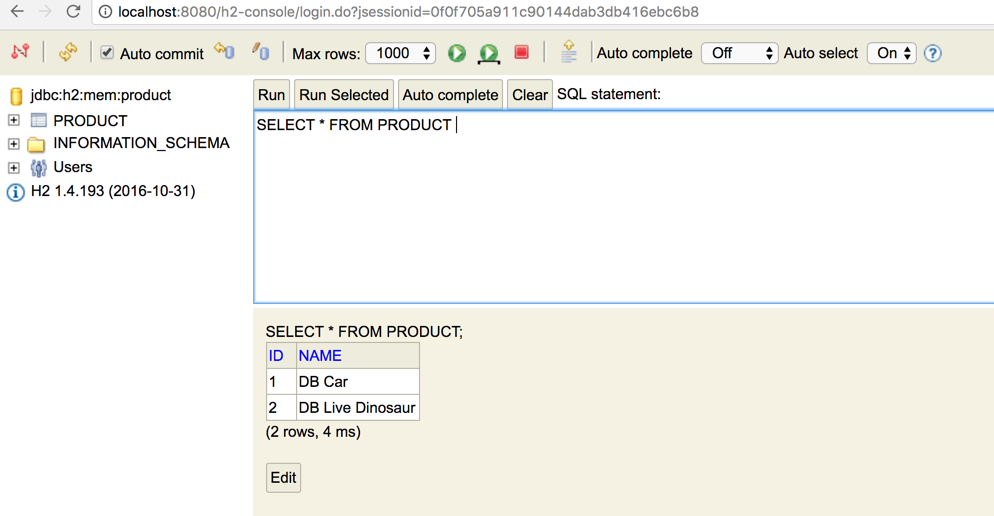
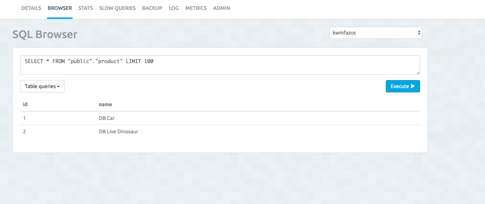

# Lab 2

In this lab we will cover persistence and DB migrations for the Product service

## Concepts To Learn

1. Updating a Pojo to be persisted
2. Adding and working with Flyway in Spring Boot
3. Working with Spring Data repositories
4. Runing local tests with H2
5. Connecting to DB running in your PCF space

## Prerequisites
If you wish to use Lombok for this lab, you can follow these instructions to install it:

https://projectlombok.org/download.html

## Add The Required Dependancies

```shell


// https://mvnrepository.com/artifact/com.h2database/h2
compile group: 'com.h2database', name: 'h2', version: '1.4.194'

// https://mvnrepository.com/artifact/postgresql/postgresql
compile group: 'postgresql', name: 'postgresql', version: '9.4.1208-jdbc42-atlassian-hosted'

// https://mvnrepository.com/artifact/org.springframework.boot/spring-boot-starter-data-jpa
compile group: 'org.springframework.boot', name: 'spring-boot-starter-data-jpa'


```

## Update the Pojo

Update the Pojo class to have the annotations @Entity and @Id

```java

import javax.persistence.Entity;
import javax.persistence.Id;

@Entity
public class Product {
	
	@Id
	private Long id;
	private String name;
	
	public Product() { }
 	
	public Product(Long id, String name) {
		this.id = id;
		this.name = name;
	}

	public String getName() {
		return name;
	}

	public void setName(String name) {
		this.name = name;
	}

	public Long getId() {
		return id;
	}

	public void setId(Long id) {
		this.id = id;
	}

}


```

NOTE: This would work with a Lombok class as well

## Create the Repository Class

Create a new Class that looks like the following:

```java


import org.springframework.data.repository.CrudRepository;

public interface ProductRepo extends CrudRepository<Product, Long> {

}

```

## Add Some Logic To Write To The DB

Update the main method to include a method to create a CommandLineRunner bean. This will be executed each time the application starts.

```java

@SpringBootApplication
public class ProductServiceApplication {

	public static void main(String[] args) {
		SpringApplication.run(ProductServiceApplication.class, args);
	}
	
	@Bean
	public CommandLineRunner demo(ProductRepo repo) {
		return (args) -> {
			repo.save(new Product(Long.valueOf(1), "DB Car"));
			repo.save(new Product(Long.valueOf(2), "DB Live Dinosaur"));
		};
	}
}


```

## Update the controller to use the repository

Next we can update the end point to use the new repository.

```java

private ProductRepo productRepo;
	
	public ProductController(ProductRepo productRepo) {
		this.productRepo = productRepo;
	};
	
	
	
	@GetMapping("/product")
	public ResponseEntity<Iterable<Product>> products() {

		return ResponseEntity.ok(productRepo.findAll());

	
	}


```

## Add Some Useful Settings

In application.properties, add the following:

```shell

spring.jpa.generate-ddl=true
spring.jpa.show-sql=true
spring.datasource.url=jdbc:h2:mem:product;DB_CLOSE_DELAY=-1

```

Restart the application and test. Note in the logs that H2 is being used. Spring Boot has created all the wiring to use Hiberate, H2 and Java persistence.

```shell

2017-04-21 10:46:38.599  INFO 4379 --- [ost-startStop-1] o.s.b.w.servlet.ServletRegistrationBean  : Mapping servlet: 'dispatcherServlet' to [/]
2017-04-21 10:46:38.600  INFO 4379 --- [ost-startStop-1] o.s.b.w.servlet.ServletRegistrationBean  : Mapping servlet: 'webServlet' to [/h2-console/*]
2017-04-21 10:46:39.035  INFO 4379 --- [           main] j.LocalContainerEntityManagerFactoryBean : Building JPA container EntityManagerFactory for persistence unit 'default'
2017-04-21 10:46:39.051  INFO 4379 --- [           main] o.hibernate.jpa.internal.util.LogHelper  : HHH000204: Processing PersistenceUnitInfo [
	name: default
	...]
2017-04-21 10:46:39.237  INFO 4379 --- [           main] org.hibernate.Version                    : HHH000412: Hibernate Core {5.0.12.Final}
2017-04-21 10:46:39.239  INFO 4379 --- [           main] org.hibernate.cfg.Environment            : HHH000206: hibernate.properties not found
2017-04-21 10:46:39.240  INFO 4379 --- [           main] org.hibernate.cfg.Environment            : HHH000021: Bytecode provider name : javassist
2017-04-21 10:46:39.277  INFO 4379 --- [           main] o.hibernate.annotations.common.Version   : HCANN000001: Hibernate Commons Annotations {5.0.1.Final}
2017-04-21 10:46:39.392  INFO 4379 --- [           main] org.hibernate.dialect.Dialect            : HHH000400: Using dialect: org.hibernate.dialect.H2Dialect
2017-04-21 10:46:39.793  INFO 4379 --- [           main] org.hibernate.tool.hbm2ddl.SchemaExport  : HHH000227: Running hbm2ddl schema export
2017-04-21 10:46:39.798  INFO 4379 --- [           main] org.hibernate.tool.hbm2ddl.SchemaExport  : HHH000230: Schema export complete
2017-04-21 10:46:39.831  INFO 4379 --- [           main] j.LocalContainerEntityManagerFactoryBean : Initialized JPA EntityManagerFactory for persistence unit 'default'

```

## View The Database

We can now test the UI for Hiberate to see our data. Spring Boot exposes an H2 UI.

### Enable and Configure H2 Console

Before we can view the console, update the console and update security to allows access to it.

Update the application.properties/yml to include the following setting:

```shell

spring.h2.console.enabled=true

```
Next we can update security to allow access to the console.

```java

@Override
	public void configure(HttpSecurity http) throws Exception {
		http.httpBasic();
		http
			.headers().frameOptions().disable()
			.and()
			.antMatcher("/**")
		      .authorizeRequests()
		        .antMatchers("/h2-console/**")
		        .permitAll()
		      .anyRequest()
		       .authenticated();
		http.csrf().disable();
	}
```
Restart your application after making this change. You will now be able to use the h2-console:

http://localhost:8080/h2-console/



## Create a Data Source In Cloud Foundry

Using the CLI (or the web portal), create a DB service.

```shell

➜  cf-micro-service-architecture git:(master) cf create-service elephantsql turtle product-db
Creating service instance product-db in org cloud-native / space development as luke.shannon@gmail.com...
OK

```

Update the manifest.yml file to include the ser

```shell

---
applications:
- name: shannon-product-service
  memory: 1024M
  buildpack: java_buildpack
  path: target/product-service-0.0.1-SNAPSHOT.jar
  routes:
  - route: shannon-product-service.cfapps.io
  services:
    - product-db

```

Now push the application into PCF using the CLI or the STS plugin. In the logs you will see the binding of the DB to your application. This puts the credentials of the newly created DB into the VCAPS entry of your container. Spring Boot will detect this is wire your DB connection to use this. H2 is ignored.

After the push is completed, view your /env endpoint, in the details returned you will see it is now connect to your DB.

You can now test your endpoint to ensure the data is there. The Postgres Services we used also spins up a management console where we can see data in the DB.



## Adding Flyway

This approach 


