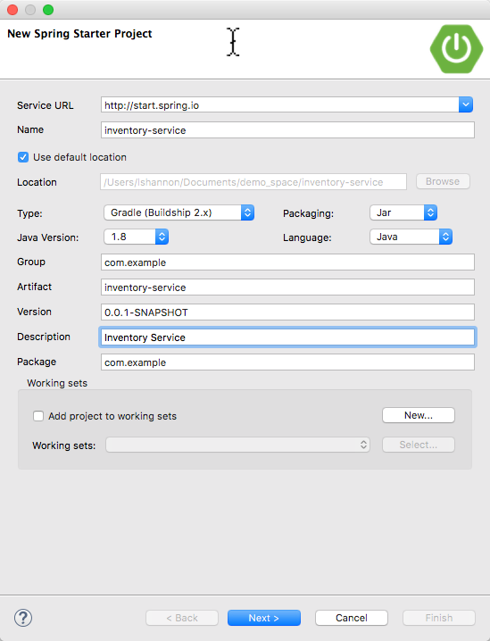
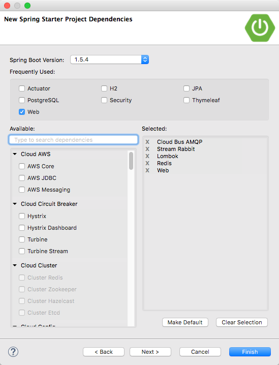
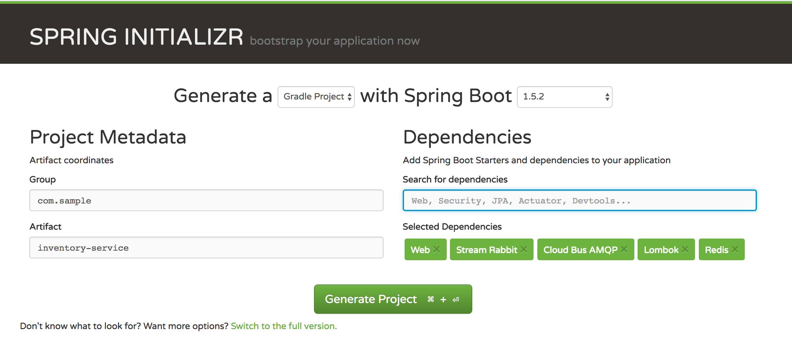

# Lab 3

In this lab we will create a new simple service that we can send a message to, and then persist the data in this message to Redis.

## Concepts To Learn
1. Working with Spring Data Repositories to persist to Redis
2. Sending and Receiving Messages using RabbitMQ and Spring Cloud Stream

### Pre-Requisites for running in local [Optional]
Only do this section to develop/test locally without PCF or PCF Dev. During the labs we will be developing and testing with PWS to save time.

For future reference, the following is for a local set up:
1. Java 8
2. Docker should be installed in your system
  * Windows 7,  [use Docker Toolbox](https://www.docker.com/products/docker-toolbox). When installing, make sure to select **ALL** the install options
  * Mac,  [use docker for Mac](https://docs.docker.com/docker-for-mac/)
  * Once the docker is running, you will need to run redis cache in docker

3. Lombok Setup (refer to set up directions https://github.com/lshannon/cf-micro-service-architecture)

4. Good to have - PostMan, from [Google webstore](https://www.google.ca/url?sa=t&rct=j&q=&esrc=s&source=web&cd=1&cad=rja&uact=8&ved=0ahUKEwi2te35xJLTAhXn3YMKHXJmAogQFggjMAA&url=https%3A%2F%2Fchrome.google.com%2Fwebstore%2Fdetail%2Fpostman%2Ffhbjgbiflinjbdggehcddcbncdddomop%3Fhl%3Den&usg=AFQjCNE_Yq59TT1ZExzJ68FTldg4ho_lGw&sig2=oDm4-jzg6EBrl9oqurNFIQ)


### Generating the Spring Boot Application
Go to  [Spring Initializr](http://start.spring.io/)
Create a new Spring Boot project as was done in the previous Labs. This project will be called 'inventory service' and will have the following dependancies:
* AMQP - [read more on AMQP](https://projects.spring.io/spring-amqp/)
* Stream Rabbit [read more on messaging with RabbitMQ](https://spring.io/guides/gs/messaging-rabbitmq/)
* Cloud Connectors [read more on cloud connectors](http://cloud.spring.io/spring-cloud-connectors/)
* Lombok [read more on Lombok](https://projectlombok.org/)
* Redis [read more on Redis](https://redis.io/)

Creating the project in STS:



In STS the dependancies will look like this.



For Spring Initializer, they will look like this:



### Dependencies in build.gradle
Once the project has been generated, it will be downloaded to your system as a zip file. Extract it to any prefered location. Open the project in your favorite IDE.
You will see that the basic project structure will be made for you.
Take a look at **build.gradle**. In the code snippet below you can see all the dependencies have been added.

```java

dependencies {
	compile('org.springframework.cloud:spring-cloud-starter-bus-amqp')
	compile('org.springframework.cloud:spring-cloud-starter-stream-rabbit')
	compile('org.springframework.boot:spring-boot-starter-data-redis')
	compile('org.springframework.boot:spring-boot-starter-web')
	compileOnly('org.projectlombok:lombok')
	testCompile('org.springframework.boot:spring-boot-starter-test')
}


```
### Let's start the application
To start the application, right click the application select 'Run InventoryServiceApplication main()'.
You can see the server startup in the console.

### Separation of profiles for our application
Let's add a dev profile for our project
Create 'application.yml' under src/main/resources.
```yml
spring:
  application:
    name: inventory-service
---
spring:
  profiles: dev
server:
    port: 8084
```
A YAML file is actually a sequence of documents separated by --- lines, and each document is parsed separately to a flattened map.

If a YAML document contains a spring.profiles key, then the profiles value (comma-separated list of profiles) is fed into the Spring Environment.acceptsProfiles(), and if any of those profiles are active, then that document is included in the final merge (otherwise not).

Once this is done, add the line below to your run configuration or to your application.properties\ run configurations

```java
spring.profiles.active:dev
```
Let's restart the server. You should see the following line in the console
```java
com.sample.InventoryServiceApplication   : The following profiles are active: dev
```

### [OPTIONAL] Running RabbitMQ and Redis instances in your machine using docker
Pre-requisite : Install docker in your machine, Take a look at `Pre-Requisites for running in local` section to find instructions for Docker installation.

Add docker compose file at inventory-service/docker-compose.yml
```yml
version: "3"
services:
 redis:
  image: redis:alpine
  container_name: training-redis
  ports:
    - "6379:6379"
 rabbitmq:
  image: rabbitmq:3.6.6-management
  container_name: training-rabbitmq
  ports:
    - "15672:15672"
    - "5672:5672"
```
  * On Mac, open your terminal and run the below command
  * On Windows, start Docker (Docker Quick Start Terminal), go to the training module path. Run the below command

```shell
$ docker-compose up -d
```
### Creating The Model

Create a 'model' package to add to your pojo classes.
Let's make the model class have the following variables :
* id;
* productName;

at /src/main/java/com/sample/model/Inventory.java
```java
//lombok annotations
@Data
@NoArgsConstructor
@AllArgsConstructor
@Builder
public class Inventory implements Serializable {
    private static final long serialVersionUID = 3734899149255587948L;

    private String id;
    @NotEmpty
    private String productName;
}
```
Note the lombok annotations! You can check out the various functionalities of lombok [here](https://projectlombok.org/).

### Create a Repository for CRUD Operations

Let's create a repository to perform CRUD operation on the order object. For this we will create a package called **repository** in our project struture. Add an interface **InventoryRepository**.
This class should be annotated with @Repository annotation.

What does this annotation do?
Indicates that the beans will be eligible for persistence exception translation.

The interface should extend CrudRepository, as it will be leveraging CRUD functionalities. 

at /src/main/java/com/sample/repository/InventoryRepository.java
```java
package com.sample.repository;

import com.sample.model.Inventory;
import org.springframework.data.repository.CrudRepository;

public interface InventoryRepository extends CrudRepository<Inventory, String> {
}
```
**InventoryRepository** extends the CrudRepository interface. The type of entity and ID that it works with,Inventory and String, are specified in the generic parameters on CrudRepository. By extending CrudRepository, InventoryRepository inherits several methods for working with Inventory persistence, including methods for saving, deleting, and finding Inventory entities.

Spring Data JPA also allows you to define other query methods by simply declaring their method signature. 

In a typical Java application, you’d expect to write a class that implements InventoryRepository. But that’s what makes Spring Data JPA so powerful: You don’t have to write an implementation of the repository interface. Spring Data JPA creates an implementation on the fly when you run the application.
More details of spring JPA repositories can be found here - [Getting Started with Spring JPA](https://spring.io/guides/gs/accessing-data-jpa/)

### Adding Redis Cache to our Application
Inorder to add the redis cache functionality, let's change our POJO order class. All we need to do is add the RedisHash annotation to :
src/main/java/com/sample/model/Inventory.java

```java
package com.sample.model;

import lombok.AllArgsConstructor;
import lombok.Builder;
import lombok.Data;
import lombok.NoArgsConstructor;
import org.hibernate.validator.constraints.NotEmpty;
import org.springframework.data.annotation.Id;
import org.springframework.data.redis.core.RedisHash;
import org.springframework.data.redis.core.index.Indexed;

import java.io.Serializable;

@RedisHash("Inventory")
//lombok
@Data
@NoArgsConstructor
@AllArgsConstructor
@Builder
public class Inventory implements Serializable {
    private static final long serialVersionUID = 3734899149255587948L;

    @Id
    private Integer id;

    @Indexed
    @NotEmpty
    private String productName;
}
```
RedisHash marks Objects as aggregate roots to be stored in a Redis hash.

Properties annotated with @Id as well as those named id are considered as the identifier properties. Those with the annotation are favored over others. More on this at [Spring Data Redis](http://docs.spring.io/spring-data/redis/docs/current/reference/html/)

Note that the property named id annotated with org.springframework.data.annotation.Id and a @RedisHash annotation on its type. Those two are responsible for creating the actual key used to persist the hash. Taken from [Spring Data Redis](http://docs.spring.io/spring-data/redis/docs/current/reference/html/)


### Creating a service class
1. Create a **service** package in your project structure /src/main/java/com/sample/service/InventoryService.java
2. Create InventoryService in the package
3. Annotate InventoryService with @Service
  * Indicates that an annotated class is a "Service"
```java
package com.sample.service;

import com.sample.model.Inventory;
import com.sample.repository.InventoryRepository;
import lombok.extern.slf4j.Slf4j;
import org.springframework.dao.DataIntegrityViolationException;
import org.springframework.stereotype.Service;
import org.springframework.transaction.annotation.Transactional;

import java.util.UUID;

@Service
@Slf4j
public class InventoryService {
    InventoryRepository inventoryRepository;

    public InventoryService(InventoryRepository inventoryRepository) {
        this.inventoryRepository = inventoryRepository;
    }

    public Iterable<Inventory> listAll() {
        return inventoryRepository.findAll();
    }

    @Transactional
    public Inventory createInventory(Inventory inventory) {
        try {
            inventory.setId(UUID.randomUUID().toString());
            inventory.setStatus(false);
            return inventoryRepository.save(inventory);
        } catch (DataIntegrityViolationException e) {
            log.error("redis save threw an error", e);
            throw new DataIntegrityViolationException("Failed to create an inventory");
        }
    }
}
```

### Creating a Simple RestEndpoint
1. Create a **controller** package in your project structure at /src/main/java/com/sample/controller/InventoryController.java
2. Create InventoryController.java in controller package
3. Annotate InventoryController with @RestController
  * The classes carrying this annotation are treated as controllers.

Take a look at the Controller below:

```java
package com.sample.controller;

import com.sample.model.Inventory;
import com.sample.service.InventoryService;
import lombok.extern.slf4j.Slf4j;
import org.springframework.http.ResponseEntity;
import org.springframework.web.bind.annotation.*;

import javax.validation.Valid;

@RestController
@RequestMapping("/v1")
@Slf4j
public class InventoryController {

    private final InventoryService inventoryService;

    public InventoryController(InventoryService inventoryService) {
        this.inventoryService = inventoryService;
    }

    @GetMapping(value = "/inventory" ,
            produces = "application/json")
    public ResponseEntity<Iterable<Inventory>> listAll() {
        return ResponseEntity.ok(this.inventoryService.listAll());
    }

    @PostMapping(value = "/inventory")
    public ResponseEntity<Inventory> createInventory(@RequestBody @Valid Inventory inventory) {
        return ResponseEntity.ok(this.inventoryService.createInventory(inventory));
    }
}
```
NOTE: You can add swaggerUI if needed. Instructions can be found in Lab 1. 

Let's test out the application now. The end point will be: `localhost:8084/v1/inventory` You should be seeying an empty list, the first time.
Pre-requisite:  you will need a redis instance running in your local machine. In case you don't have it setup, you can jump on to `Deploy to Cloud Foundry` section.

The create endpoint should also work, from PostMan
send the following JSON

POST localhost:8084/v1/inventory
```json
{
  "productName" : "Hammer of Thor"
}
```
You can not try the GET endpoint again, to see the above inventory added.

### Deploy to Cloud Foundry

Create a file in the root of the project called 'manifest.yml'. Add the following to this file:

```shell
---
applications:
- name: inventory-service
  memory: 1024M
  buildpack: java_buildpack
  path: build/libs/inventory-service-0.0.1-SNAPSHOT.jar
  env:
    CF_TARGET: https://api.run.pivotal.io
  services:
    - hopper-training-redis-cache
```

Ensure to clean and build your Gradle project and then deploy to PWS by running `cf push` from the same folder as the manifest.yml. Also you can deploy to PCF using the STS plugin. If the host is already taken, update the `route` name to be more unique in the manifest.yml file.

As you can see, we have hopper-training-redis-cache as one service. You will need to bind a redis service using PCF marketplace.

### Adding RabbitMQ
Pre-requisite : Product-service is up and running (From Lab -1)
1. build.gradle dependencies
2. EnableBinding
3. set the output and input channels in both inventory-service and product-service

Make sure these three dependecnies are present in yout build.gradle file
```gradle
compile ('org.springframework.cloud:spring-cloud-starter-stream-rabbit:1.1.3.RELEASE')
compile 'org.springframework.cloud:spring-cloud-spring-service-connector:1.2.3.RELEASE'
compile 'org.springframework.cloud:spring-cloud-cloudfoundry-connector:1.2.3.RELEASE'
```
Spring Cloud Stream is a framework for building message-driven microservices.
The Cloud Foundry Connector is part of the Spring Cloud Connectors project.

### Adding messaging channels

create a package 'messaging'
at /src/main/java/com/sample/messaging/InventoryChannel.java
```java 
package com.sample.messaging;

import org.springframework.cloud.stream.annotation.Input;
import org.springframework.cloud.stream.annotation.Output;
import org.springframework.messaging.MessageChannel;

public interface InventoryChannel {

    @Output
    MessageChannel inventoryChannel();

}
```
@Output Indicates that an output binding target will be created by the framework.

### Adding the MessageWriter
at /src/main/java/com/sample/messaging/MessageWriter.java
```java
package com.sample.messaging;

import org.springframework.integration.annotation.Gateway;
import org.springframework.integration.annotation.MessagingGateway;

@MessagingGateway
public interface MessageWriter {

    @Gateway(requestChannel = "inventoryChannel")
    void write(String productName);

}
```

### Binding the channel to application

In InventoryServiceApplication.java. Add the following annotation. 
```java
@EnableBinding(InventoryChannel.class)
```
By adding @EnableBinding to your main application, you get immediate connectivity to a message broker and by adding @StreamListener to a method, you will receive events for stream processing.

Now, let's call the messageWriter from our InventoryService
```java
@Service
@Slf4j
public class InventoryService {
    private final InventoryRepository inventoryRepository;
    private final MessageWriter messageWriter;

    public InventoryService(InventoryRepository inventoryRepository,
                            MessageWriter messageWriter) {
        this.inventoryRepository = inventoryRepository;
        this.messageWriter = messageWriter;
    }

    public Iterable<Inventory> listAll() {
        return inventoryRepository.findAll();
    }

    @Transactional
    public Inventory createInventory(Inventory inventory) {
        try {
            inventory.setId(UUID.randomUUID().toString());
            messageWriter.write(inventory.getProductName());
            return inventoryRepository.save(inventory);
        } catch (DataIntegrityViolationException e) {
            log.error("redis save threw an error", e);
            throw new DataIntegrityViolationException("Failed to create an inventory");
        }
    }
}
```
Note the MessageWriter service autowired to the service class, also it's invoked before repository save is called.
### Messaging channel in product-service
Now, we have added Messaging functionality to Inventory-service. Now let's do the same for Product-service.

Add the build.gradle dependencies
```gradle
compile ('org.springframework.cloud:spring-cloud-starter-stream-rabbit:1.1.3.RELEASE')
compile 'org.springframework.cloud:spring-cloud-spring-service-connector:1.2.3.RELEASE'
compile 'org.springframework.cloud:spring-cloud-cloudfoundry-connector:1.2.3.RELEASE'
```
at /src/main/java/com/sample/messaging/ProductChannels.java
```java
package com.sample.messaging;

import org.springframework.cloud.stream.annotation.Input;
import org.springframework.messaging.SubscribableChannel;

public interface ProductChannels {

    @Input
    SubscribableChannel inventoryChannel();
}
```
at /src/main/java/com/sample/messaging/MessageListener.java
```java
package com.sample.messaging;

import org.slf4j.Logger;
import org.slf4j.LoggerFactory;
import org.springframework.cloud.stream.annotation.StreamListener;
import org.springframework.integration.annotation.MessageEndpoint;
import org.springframework.transaction.annotation.Transactional;

@MessageEndpoint
public class MessageListener {
    private static final Logger log = LoggerFactory.getLogger(MessageListener.class);

    @StreamListener(value = "inventoryChannel")
    @Transactional
    public void process(String productName) {
        log.info("product Name recieved " + productName);
    }
}
```
Don't forget to add @EnableBinding to product-service application.
```java
@EnableBinding(ProductChannels.class)
```
### Adding the service in manifest files 

Don't forget to add the service in manifest file of both Inventory-service and Product-service
```shell
  - hopper-training-rabbitmq
```

Clean build both the applications and redeploy to PCF. Make sure to bind RabbitMQ service from marketplace.

Now, run the application and check the logs to see if the product name send from inventory-place service is logged at product-service. 
Also, now to can try wiring up simple-ui service to inventory-service and play around with it :-)

