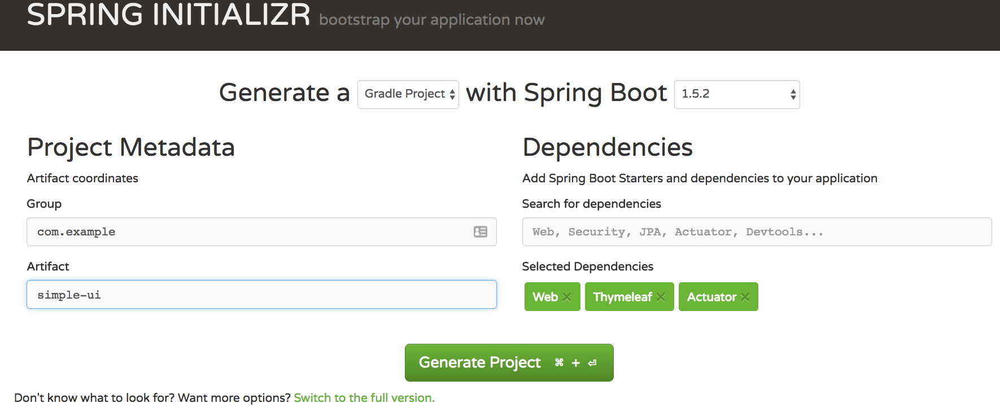

# Labs

The following are some of hands on exercises to reinforce key concepts in the Marketplace Service

## Concepts To Learn
1. Create a simple UI using Spring Boot and ThymeLeaf
2. Create a simple Product Backing Service using Spring Boot
3. Create a simple Order Backing Service using Spring Boot
4. Communicate Via Rest Between Two Services
5. Deploying To PCF
6. Trouble Shooting and Monitoring

## Building Out The Rest Services

Lets create a basic Rest Client.

```shell

curl https://start.spring.io/starter.tgz -d style=web,actuator -d groupId=com.sample -d name=product-service -d type=gradle-project | tar -xzvf -

```
If you are using start.spring.io, simply select the following projects.



### Create The Model Object

Create a class called Product. Add the following attributes:

```java

public class Product {

	private Long id;
	private String name;
  
  public Product() { }

	public Product(Long id, String name) {
		this.id = id;
		this.name = name;
	}

	public String getName() {
		return name;
	}

	public void setName(String name) {
		this.name = name;
	}

	public Long getId() {
		return id;
	}

	public void setId(Long id) {
		this.id = id;
	}

}

```

Optionally this can be converted to Lombok to dramatically reduce the lines of code in the object definition. Why would this matter?

### Create the Rest Endpoint

Create a class called Product Controller.

Add the following:

```java

@RestController
@RequestMapping("/v1")
public class ProductController {
	
	@GetMapping("/product")
	public ResponseEntity<Iterable<Product>> products() {
  
		List<Product> products = new ArrayList<Product>();
		products.add(new Product(Long.valueOf(1), "Car"));
		products.add(new Product(Long.valueOf(2), "Boat"));
		products.add(new Product(Long.valueOf(3), "Real Live Dinosaur"));
		return ResponseEntity.ok(products);
	}

}


```

Start your application and test the end point at: http://localhost:8080/v1/product

### Enable Actuator

Add the following to your application.properties/application.yml

```shell

endpoints.sensitive=false

```

Restart your application and try some of the end points:

- http://localhost:8080/mappings
- http://localhost:8080/health
- http://localhost:8080/env

### Deploy to Cloud Foundry

Create a file in the root of the project called 'manifest.yml'. Add the following to this file:

```shell

---
applications:
- name: product-service
  memory: 1024M
  buildpack: java_buildpack
  path: target/product-service-0.0.1-SNAPSHOT.jar
  routes:
  - route: product-service.cfapps.io


```

Ensure to clean and build your Gradle project and then deploy to PWS by running `cf push` from the same folder as the manifest.yml. Also you can deploy to PCF using the STS plugin. If the host is already taken, add a `host` entry to the manifest.yml file.


## Building Out The UI Client

Lets build out a basic UI. 

```shell

curl https://start.spring.io/starter.tgz -d style=web,thymeleaf,actuator -d groupId=com.sample -d name=simple-ui -d type=gradle-project | tar -xzvf -

```

If you are using start.spring.io, simply select the following projects.


Once created, import into your IDE of choice (ie: import existing Gradle project).

This project uses Thymeleaf, a very simple HTML attribute based templating engine. Lets add our basic UI. Inside of src/main/resources/templates, create a file called index.html and paste the following into it.

```html
<!DOCTYPE HTML>
<html xmlns:th="http://www.thymeleaf.org">
<head>
    <title>Simple UI</title>
    <meta http-equiv="Content-Type" content="text/html; charset=UTF-8" />
</head>
<body>
	
	<p th:text="'Hello, ' + ${name} + '!'" />
    
</body>
</html>

```

Create a simple class to display this:

```java

@Controller
public class HomeController {
	

	@GetMapping("/")
	public String home(Model model) {
		model.addAttribute("name", "Tug Speedman!");
		return "index";
	}

}

```

## Deploy To PCF

Add a manifest like the following:

```shell

---
applications:
- name: simple-ui
  memory: 1024M
  buildpack: java_buildpack
  path: target/simple-ui-0.0.1-SNAPSHOT.jar
  routes:
  - route: simple-ui.cfapps.io

```

## Using RestTemplate To Communicate Between Services

Lets connect the services to together adding RestTemplate.

### Creating the Service Class

Create a Service Class in the simple-ui list the following

```java

@Service
public class ProductService {

	private RestTemplate restTemplate;

	public ProductService(RestTemplate restTemplate) {
		this.restTemplate = restTemplate;
	}

	public List<Product> getProducts() {
		ParameterizedTypeReference<List<Product>> parameterizedTypeReference = new ParameterizedTypeReference<List<Product>>() {
		};
		List<Product> products = restTemplate
				.exchange("http://localhost:8080/v1/product", HttpMethod.GET, null, parameterizedTypeReference)
				.getBody();
		return products;
	}
}

```
Wire this into the main controller.

```java

@Controller
public class HomeController {
	
	private ProductService productService;
	
	public HomeController(ProductService productService) {
		this.productService = productService;
	}


	@GetMapping("/")
	public String home(Model model) {
		List<Product> products = productService.getProducts();
		model.addAttribute("products", products);
		return "index";
	}

}

```

Update the UI to reflect the new change.

```html

<!DOCTYPE HTML>
<html xmlns:th="http://www.thymeleaf.org">
<head>
    <title>Simple UI</title>
    <meta http-equiv="Content-Type" content="text/html; charset=UTF-8" />
</head>
<body>
	
	<p>Here is what we have today!</p>
    
    <table>
    <tr th:each="product : ${products}">
        <td th:text="${product.name}">1</td>
    </tr>
    </table>
    
</body>
</html>

```

## Deploy To PCF

Rebuild the UI service and push it to PCF again.

## Adding Security To The Marketplace

## Deploying To PCF

## Troubleshooting and Monitoring
